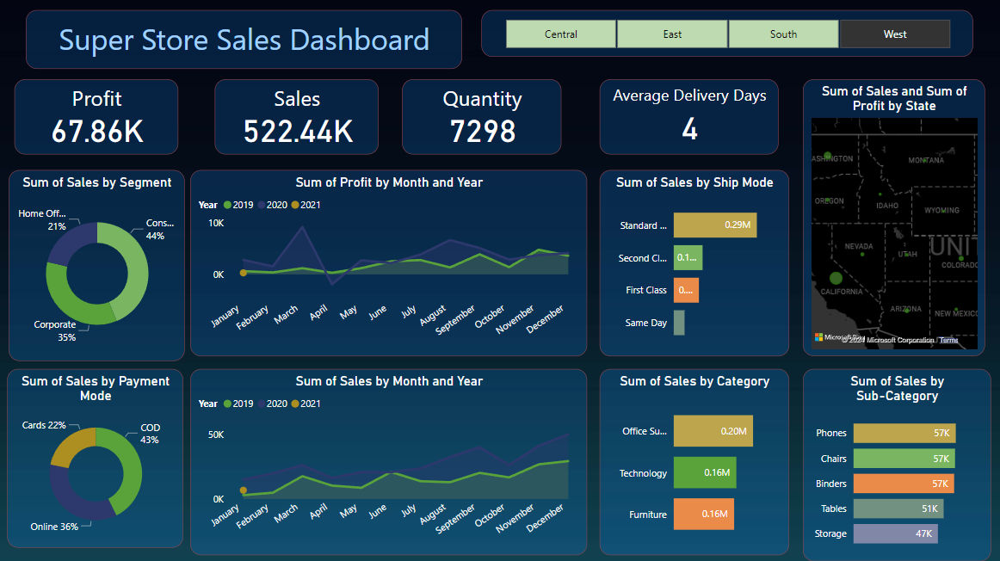

# Super Store Sales Dashboard

## Overview
This Power BI project presents an interactive dashboard showcasing key performance indicators (KPIs) and insights derived from sales data of a fictional superstore. The dashboard allows users to explore sales performance across different regions, segments, payment modes, categories, and more.

## Screenshot

## Features
- **KPIs Overview:** The dashboard displays KPIs including Profit, Sales, Quantity, and Average Delivery Days.
- **Region Filter:** Users can filter data based on region (East, West, South, Central) to view sales performance specific to each region.
- **Area Charts:** Two area charts illustrate the trend of Profit and Sales over months and years. Users can toggle between monthly and yearly views.
- **Donut Charts:** Two donut charts provide insights into sales distribution by Segment and Payment Mode.
- **Clustered Bar Charts:** Three clustered bar charts showcase sales breakdown by Ship Mode, Category, and Sub-category.
- **Sales Map:** A map visualization displays sales geographically, allowing users to visualize sales performance across different areas based on the selected region filter.

Thank you for exploring the Super Store Sales Dashboard!
